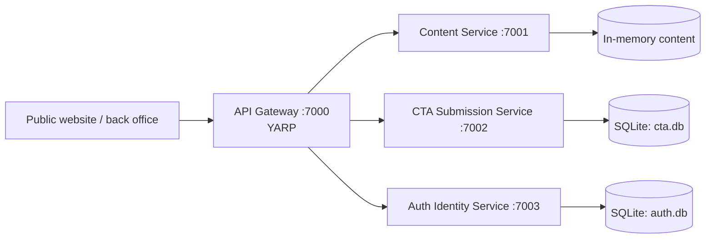

# KJWebsite.Backend

The .NET 10 backend scaffold for Kolpojontro Foundation's public site and future back office. It currently serves development APIs and is not a production deployment.

> [!WARNING]
> ## Development-only security — do not deploy
> This implementation is **not production-safe**: passwords are stored in plain text, access tokens are held only in process memory, and content administration accepts the hard-coded `dev-admin-token`. Hardening is P1 work.
>
> The development seed account is `admin@site.org` / `admin123`. Use it only on an isolated local machine and **never reuse these credentials or the admin token** in another environment. Do not expose the current backend publicly.

## Overview

Four ASP.NET Core Minimal API services sit behind a YARP gateway. The gateway is the public API entry point for the public website and future back office. The implementation roadmap is [docs/MASTER_PLAN.md](docs/MASTER_PLAN.md); the program plan is [docs/PROGRAM_MASTER_PLAN.md](docs/PROGRAM_MASTER_PLAN.md).

## API preview

| Service | Scalar reference | Health check |
|---|---|---|
| API Gateway | http://localhost:7000/scalar/v1 | http://localhost:7000/health |
| Content Service | http://localhost:7001/scalar/v1 | http://localhost:7001/health |
| CTA Submission Service | http://localhost:7002/scalar/v1 | http://localhost:7002/health |
| Auth Identity Service | http://localhost:7003/scalar/v1 | http://localhost:7003/health |

## Tech stack

| Concern | Technology | Version / status |
|---|---|---|
| Runtime | .NET / C# | SDK 10.0.300; projects target `net10.0` |
| HTTP APIs | ASP.NET Core Minimal APIs | .NET 10 |
| Gateway | YARP | 2.2.0 |
| API reference | ASP.NET Core OpenAPI / Scalar | 10.0.8 / 2.14.14 |
| Data | EF Core with SQLite | 10.0.8; Auth and CTA only |
| Contract | `openapi.v1.yaml` | generated and committed |

No build, coverage, or deployment badges are shown because CI and hosted deployment do not exist yet.

## Architecture



| Service | Port | Responsibility | Database | Exposure |
|---|---:|---|---|---|
| `ApiGateway` | 7000 | Routes content, CTA, auth, and admin-content APIs | None | Public entry point |
| `ContentService` | 7001 | Public projects/news and admin mutations | In-memory; resets on restart | Internal |
| `CtaSubmissionService` | 7002 | CTA and registration-form submissions | SQLite (`cta.db`) | Internal |
| `AuthIdentityService` | 7003 | Registration, login, refresh, logout, and profile | SQLite (`auth.db`) | Internal |

## Getting started

### Prerequisites

- [.NET SDK 10.0.300](https://dotnet.microsoft.com/download) or compatible .NET 10 SDK
- The manifest-managed `dotnet-ef` tool
- Docker Desktop or Docker Engine with Compose, if running the container stack

```bash
dotnet tool restore
dotnet restore KJWebsite.Backend.slnx
dotnet build KJWebsite.Backend.slnx -c Debug
```

On Windows, use `dotnet` from a terminal with the SDK on `PATH`; do not hard-code `C:\\Program Files\\dotnet\\dotnet.exe`.

### Run all services locally

Open four terminals from the repository root:

```bash
dotnet run --project src/Services/ApiGateway --launch-profile http
dotnet run --project src/Services/ContentService --launch-profile http
dotnet run --project src/Services/CtaSubmissionService --launch-profile http
dotnet run --project src/Services/AuthIdentityService --launch-profile http
```

The gateway at `http://localhost:7000` expects the downstream services on their listed ports. Scalar and health URLs are in [API preview](#api-preview).

### Run the full stack with Docker

With Docker installed, start every service and its local dependencies from the repository root:

```bash
docker compose up --build
```

The API Gateway Scalar reference is at http://localhost:7000/scalar/v1. Health endpoints are available on ports 7000–7003 at `/health`; MailHog is at http://localhost:8025. The Compose credentials are development-only and PostgreSQL data persists in the `postgres-data` volume. Stop the stack with `docker compose down`; add `--volumes` only when you intentionally want to discard local database data.

### Configuration

| Variable | Required | Default | Purpose |
|---|---|---|---|
| `ASPNETCORE_ENVIRONMENT` | No | Host default | Use `Development` locally; Scalar and runtime OpenAPI are mapped only then. |
| `ASPNETCORE_URLS` | No | `launchSettings.json` port | Overrides a listener. Containers use port 8080 internally. |
| `ConnectionStrings__AuthDb` | No | `Data Source=auth.db` | Auth SQLite connection string. |
| `ConnectionStrings__CtaDb` | No | `Data Source=cta.db` | CTA SQLite connection string. |
| `Database__Provider` | No | SQLite | Set to `PostgreSql` for the Compose Auth and CTA containers. |
| `Services__{Content,Cta,Auth}__Url` | No | Localhost service ports | Gateway downstream destination overrides. |

No production secret configuration exists. P1 must use environment/vault configuration, secure auth, and restrictive CORS.

## Database and migrations

Auth and CTA apply their EF Core migrations at startup when using SQLite. The Docker Compose stack instead uses separate development PostgreSQL databases (`auth` and `cta`) and initializes their current schemas with `EnsureCreated`; it does not apply the SQLite migrations. Neither option is production storage. Create and apply an Auth migration with:

```bash
dotnet ef migrations add <MigrationName> --project src/Services/AuthIdentityService --startup-project src/Services/AuthIdentityService
dotnet ef database update --project src/Services/AuthIdentityService --startup-project src/Services/AuthIdentityService
```

Use the equivalent CTA paths for CTA migrations. Content has no database and resets on restart. P1 will introduce PostgreSQL, Npgsql, schema-per-module design, re-baselined migrations, and a documented one-way development-data migration; do not repoint the current SQLite migrations at PostgreSQL.

## API contract

[`openapi.v1.yaml`](openapi.v1.yaml) is the committed gateway-level v1 contract. Regenerate and verify it after endpoint metadata changes:

```bash
dotnet run --project tools/OpenApiExporter
dotnet run --project tools/OpenApiExporter -- --verify
```

The cross-platform exporter starts the four services in `Development` on temporary loopback ports, fetches `/openapi/v1.json`, merges the gateway health route with downstream API routes, writes deterministic YAML, then stops the temporary processes. `--verify` fails on contract drift and does not modify local SQLite data.

The frontend should generate its typed client or mock from the committed YAML, not a developer's live service URL. Scalar is for local exploration only.

## Project structure

```text
src/BuildingBlocks/              shared building-block project (currently minimal)
src/Services/                    gateway and three API services
tools/OpenApiExporter/           runtime OpenAPI aggregation tool
openapi.v1.yaml                  committed v1 API contract
docs/                            backend and program plans
kj-registration*/               read-only historical ASP.NET snapshots
```

## Development workflow

Branch from `develop` using `feature/*` or `fix/*`; `main` is the intended production branch. Use conventional commits and squash-merge pull requests. Before review, build the solution, regenerate the contract when endpoints change, run contract verification, and keep this README truthful.

## Testing

Unit and integration tests are available; integration tests use Testcontainers and therefore require Docker. CI does not exist yet. Minimum local verification is:

```bash
dotnet build KJWebsite.Backend.slnx
dotnet run --project tools/OpenApiExporter -- --verify
```

For API work, also exercise the affected route through the gateway. Planned, but absent, test tooling is xUnit, FluentAssertions, Testcontainers, and `WebApplicationFactory`.

## Building for production

An individual service can be published, but it is not safe to deploy while the warning above applies:

```bash
dotnet publish src/Services/ApiGateway/ApiGateway.csproj -c Release -o publish/ApiGateway
```

## Deployment

Local Docker Compose is implemented for contributor onboarding, but CI/CD, staging, and production infrastructure are not. The P1 target is CI-built, commit-SHA-tagged container images; environment/vault configuration; expand → migrate → contract migrations; health-gated traffic; and rollback to the prior image on failed health checks. Do not automatically roll database migrations backward.

## Legacy folders

`kj-registration/` and `kj-registration-AwaitingUserFeatures/` are read-only git-subtree snapshots. Mine them only for legacy membership fields, statuses, roles, and registration behavior. Never run, restore, build, deploy, or copy their tracked `.vs/` or `obj/` artifacts; they are not part of the current solution.

## Troubleshooting

| Symptom | Cause | Resolution |
|---|---|---|
| Gateway returns 502 | A downstream service is unavailable | Start all four services with the `http` profile. |
| Compose service exits on startup | PostgreSQL is not ready or its data volume uses an older layout | Run `docker compose down --volumes`, then `docker compose up --build` to recreate local development data. |
| Scalar returns 404 | Service is not in Development | Set `ASPNETCORE_ENVIRONMENT=Development` and restart. |
| `dotnet ef` is unavailable | Tools are not restored | Run `dotnet tool restore`. |
| Exporter verification fails | Contract drift | Regenerate the YAML, review it, then rerun `--verify`. |

## Roadmap, contributing, and license

Read the [backend plan](docs/MASTER_PLAN.md), [program plan](docs/PROGRAM_MASTER_PLAN.md), and [project context](PROJECT_CONTEXT.md). Keep changes additive, preserve the frontend contract, and never weaken the security notice. No license or formal contributor guide has been selected yet; use the issue tracker for repository questions.
